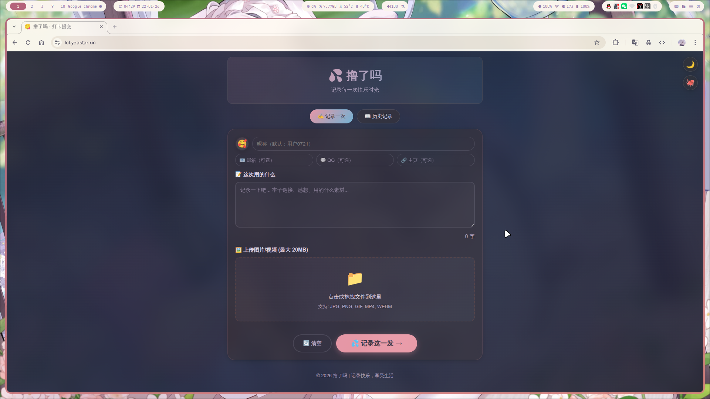

<div align="center">

# 撸了吗 (lol) 🔞

一个基于 FastAPI + SQLite 的打卡系统，支持文本和多媒体（图片/视频）内容的提交与展示。

</div>

## 📸 界面预览

<div align="center">

### 亮色模式

 

### 暗色模式

 

</div>

<div align="center">

## ✨ 功能特性

</div>

- 📝 文本打卡提交
- 🖼️ 多媒体文件上传（图片、视频，最大 50MB）
- 📦 压缩包上传支持（ZIP、7Z，自动解压预览）
- 📊 打卡记录展示与分页
- 🔗 URL 自动识别并渲染为链接
- 👤 用户信息（昵称、头像、邮箱、QQ、链接）
- ❤️ 点赞功能（基于 IP 防重复）
- 🔍 高级搜索/筛选功能
- 🌙 明暗主题切换
- 📱 响应式设计
- 🛡️ 内容审核系统（智能检测 + 管理后台）
- 🔐 管理面板（密钥认证）
- 🛠️ 数据库运维管理工具
- 🌱 测试数据生成工具
- 🧹 孤儿文件清理工具

<div align="center">

## 🛠️ 技术栈

</div>

- **后端**: Python FastAPI + Jinja2 模板 + SQLite3
- **前端**: HTML5 + CSS3 (模块化) + ES Modules

<div align="center">

## 📦 安装

</div>

推荐使用 `uv` 包管理器：

```bash
uv sync
```

<div align="center">

## 🚀 运行

</div>

```bash
uv run main.py
```

应用将在 http://localhost:8722 启动

<div align="center">

## ⚙️ 环境配置

</div>

复制 `.env.example` 为 `.env` 并配置：

```bash
cp .env.example .env
```

```env
# 管理后台密钥（必填，用于 /admin 页面登录）
ADMIN_KEY=your-secret-key-here
```

<div align="center">

## 🌐 页面访问

</div>

| 页面     | 地址                          |
| -------- | ----------------------------- |
| 打卡提交 | http://localhost:8722/        |
| 打卡展示 | http://localhost:8722/display |
| 管理后台 | http://localhost:8722/admin   |

<div align="center">

## 📡 API 接口

</div>

| 方法   | 路径                      | 说明         |
| ------ | ------------------------- | ------------ |
| `POST` | `/api/checkin`            | 提交打卡     |
| `GET`  | `/api/checkins`           | 获取打卡列表 |
| `POST` | `/api/upload`             | 上传文件     |
| `POST` | `/api/like/{id}`          | 点赞         |
| `GET`  | `/api/admin/stats`        | 审核统计 🔐   |
| `GET`  | `/api/admin/pending`      | 待审核列表 🔐 |
| `POST` | `/api/admin/approve/{id}` | 通过审核 🔐   |
| `POST` | `/api/admin/reject/{id}`  | 拒绝审核 🔐   |
| `GET`  | `/static/*`               | 访问静态文件 |

> 🔐 标记的接口需要在请求头中携带 `X-Admin-Key`

---

<div align="center">

## 🔧 数据库工具

</div>

### 📋 运维管理工具 (`scripts/db_admin.py`)

用于在服务器命令行环境对数据库进行运维、修改、更新。

#### 📖 查看记录

```bash
# 列出记录（分页）
uv run scripts/db_admin.py list
uv run scripts/db_admin.py list --page 2 --size 20

# 查看单条记录详情
uv run scripts/db_admin.py show 5

# 搜索记录
uv run scripts/db_admin.py search --content "关键词"
uv run scripts/db_admin.py search --nickname "用户"
uv run scripts/db_admin.py search --email "test@"
uv run scripts/db_admin.py search --content "本子" --nickname "小猫"
```

#### ✏️ 修改记录

```bash
# 更新单个字段
uv run scripts/db_admin.py update 5 --nickname "新昵称"
uv run scripts/db_admin.py update 5 --content "新内容"
uv run scripts/db_admin.py update 5 --love 100

# 更新多个字段
uv run scripts/db_admin.py update 5 --nickname "新昵称" --avatar "😈" --love 50

# 清空联系方式（传空字符串）
uv run scripts/db_admin.py update 5 --email ""
uv run scripts/db_admin.py update 5 --qq "" --url ""
```

#### 🗑️ 删除记录

```bash
# 删除单条（需确认）
uv run scripts/db_admin.py delete 5

# 强制删除（跳过确认）
uv run scripts/db_admin.py delete 5 -f

# 删除ID范围
uv run scripts/db_admin.py delete-range 1 10
uv run scripts/db_admin.py delete-range 100 200 -f
```

#### 📊 统计与导出

```bash
# 数据库统计（记录数、点赞、常用昵称等）
uv run scripts/db_admin.py stats

# 导出数据
uv run scripts/db_admin.py export                          # 默认 JSON
uv run scripts/db_admin.py export --format json -o data.json
uv run scripts/db_admin.py export --format csv -o data.csv

# 导入数据
uv run scripts/db_admin.py import backup.json
```

#### 🛡️ 审核管理

```bash
# 查看待审核记录
uv run scripts/db_admin.py pending
uv run scripts/db_admin.py pending --page 2 --size 20

# 审核统计
uv run scripts/db_admin.py review-stats

# 通过审核
uv run scripts/db_admin.py approve 5
uv run scripts/db_admin.py approve 5 -f    # 跳过确认

# 拒绝并删除
uv run scripts/db_admin.py reject 5
uv run scripts/db_admin.py reject 5 -f

# 拒绝并加入黑名单
uv run scripts/db_admin.py ban 5

# 批量通过
uv run scripts/db_admin.py batch-approve 1,2,3,4,5
```

#### 🧹 文件清理

```bash
# 查看孤儿文件统计（uploads 中没有数据库引用的文件）
uv run scripts/db_admin.py orphan-files

# 列出所有孤儿文件
uv run scripts/db_admin.py orphan-files --list

# 删除孤儿文件
uv run scripts/db_admin.py orphan-files --delete
uv run scripts/db_admin.py orphan-files --delete -f  # 跳过确认
```

#### ⚙️ 数据库维护

```bash
# 压缩优化（清理碎片，减小体积）
uv run scripts/db_admin.py vacuum

# 执行原始 SQL
uv run scripts/db_admin.py sql "SELECT * FROM check_ins LIMIT 5"
uv run scripts/db_admin.py sql "SELECT nickname, COUNT(*) FROM check_ins GROUP BY nickname"
uv run scripts/db_admin.py sql "UPDATE check_ins SET love = 0 WHERE love < 0"

# 清空所有数据（危险！需要双重确认）
uv run scripts/db_admin.py clear --confirm
```

---

### 🌱 测试数据生成工具 (`scripts/db_seed.py`)

用于快速生成大量测试数据，方便测试筛选/搜索/审核功能。

```bash
# 基础用法：插入 50 条随机数据
uv run scripts/db_seed.py

# 指定数量
uv run scripts/db_seed.py --count 100
uv run scripts/db_seed.py -n 200

# 指定时间范围（过去 N 天）
uv run scripts/db_seed.py --count 100 --days 7

# 指定联系方式生成概率（0-1，默认 0.3）
uv run scripts/db_seed.py --count 50 --contact-rate 0.5

# 指定待审核内容生成概率（0-1，默认 0.2）
uv run scripts/db_seed.py --count 50 --pending-rate 0.3

# 清空后重新生成
uv run scripts/db_seed.py --count 100 --clear-first

# 组合使用（生成 200 条，30% 待审核）
uv run scripts/db_seed.py -n 200 --days 14 --pending-rate 0.3 --clear-first
```

---

<div align="center">

## 📁 项目结构

</div>


```
lol/
├── main.py                    # 应用入口
├── pyproject.toml             # 项目配置
├── README.md
│
├── scripts/                   # 工具脚本
│   ├── db_admin.py            # 数据库运维管理
│   └── db_seed.py             # 测试数据生成
│
└── src/
    ├── api/
    │   └── routes.py          # API 路由
    │
    ├── db/                    # 数据库模块
    │   ├── database.py        # 兼容层（对外接口）
    │   ├── connection.py      # 连接管理
    │   ├── schema.py          # 表结构初始化
    │   ├── migrations.py      # 数据库迁移
    │   ├── models.py          # 数据模型
    │   └── repositories/      # 数据访问层
    │       ├── checkin.py     # 打卡记录 CRUD
    │       └── like.py        # 点赞 CRUD
    │
    ├── utils/
    │   └── validators.py      # 输入验证
    │
    ├── html/                  # Jinja2 模板
    │   ├── base.html          # 基础模板
    │   ├── index.jinja2       # 打卡提交页
    │   ├── display.jinja2     # 打卡展示页
    │   └── partials/          # 模板片段
    │       ├── header.html
    │       ├── nav.html
    │       ├── footer.html
    │       └── theme_buttons.html
    │
    └── static/
        ├── css/               # 样式（模块化）
        │   ├── main.css       # 入口文件
        │   ├── base/          # 基础样式
        │   │   ├── reset.css
        │   │   └── variables.css
        │   ├── layout/        # 布局样式
        │   │   ├── container.css
        │   │   ├── header.css
        │   │   ├── nav.css
        │   │   └── footer.css
        │   ├── components/    # 组件样式
        │   │   ├── buttons.css
        │   │   ├── forms.css
        │   │   ├── cards.css
        │   │   ├── modal.css
        │   │   ├── pagination.css
        │   │   ├── toast.css
        │   │   ├── like.css
        │   │   └── theme-toggle.css
        │   └── pages/         # 页面样式
        │       ├── index.css
        │       └── display.css
        │
        ├── js/                # JavaScript（ES Modules）
        │   ├── common/        # 通用模块
        │   │   ├── theme.js   # 主题切换
        │   │   ├── utils.js   # 工具函数
        │   │   ├── toast.js   # Toast 提示
        │   │   └── api.js     # API 封装
        │   └── pages/
        │       ├── index/     # 打卡页模块
        │       │   ├── main.js
        │       │   ├── form.js
        │       │   ├── upload.js
        │       │   └── avatar.js
        │       └── display/   # 展示页模块
        │           ├── main.js
        │           ├── checkins.js
        │           ├── search.js
        │           ├── sort.js
        │           ├── pagination.js
        │           ├── like.js
        │           └── modal.js
        │
        └── uploads/           # 上传文件目录（自动创建）
```

<div align="center">

## 📝 数据库版本

</div>

| 版本 | 特性                                             |
| ---- | ------------------------------------------------ |
| V1.0 | 基础打卡（内容、媒体、时间）                     |
| V2.0 | 用户信息（昵称、头像、联系方式）                 |
| V3.0 | 点赞功能（love 字段 + likes 表）                 |
| V4.0 | 压缩包支持（file_type、archive_metadata）        |
| V5.0 | 内容审核（approved、reviewed_at、review_reason） |

数据库会自动迁移，无需手动操作。

<div align="center">

## 📜 License

</div>

MIT
